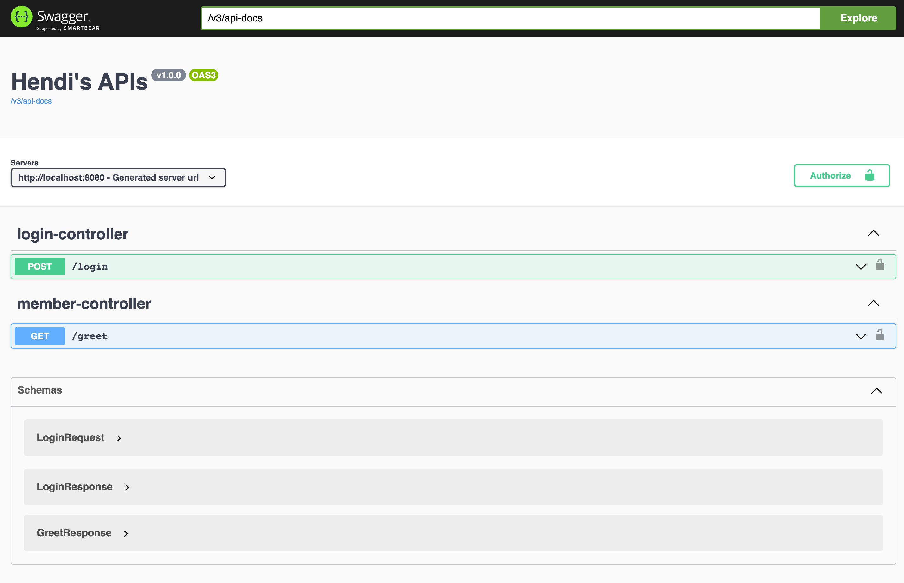
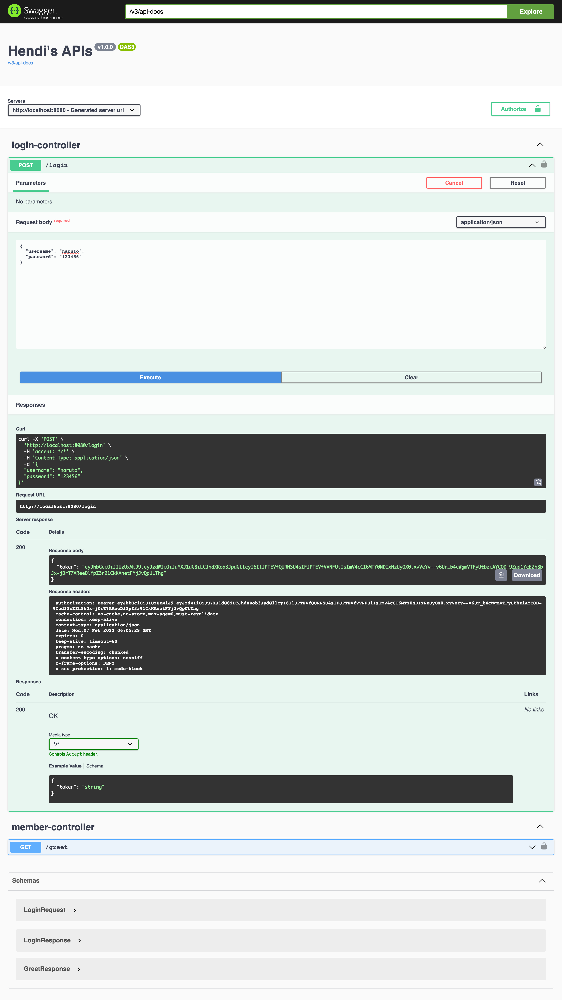
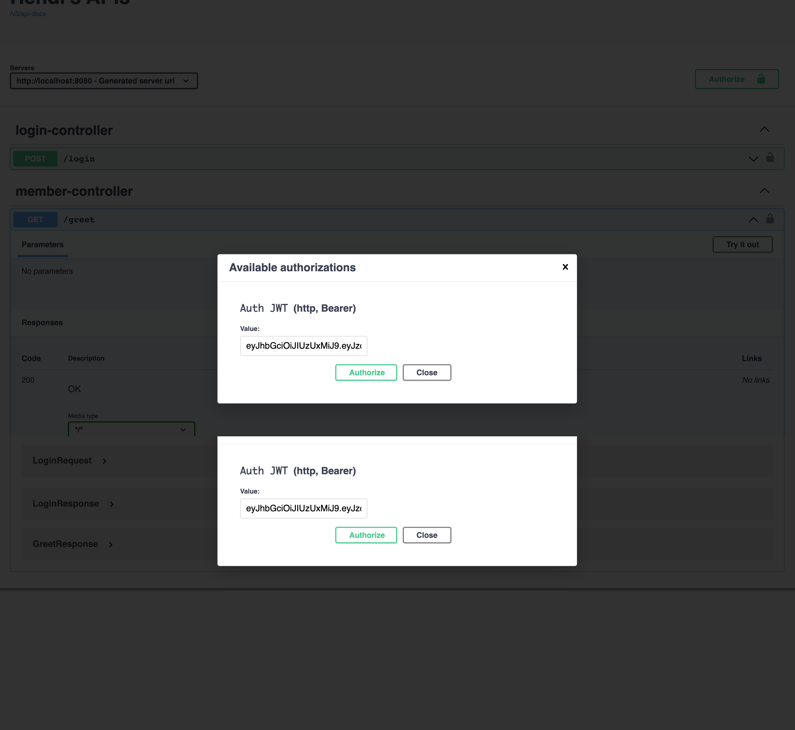
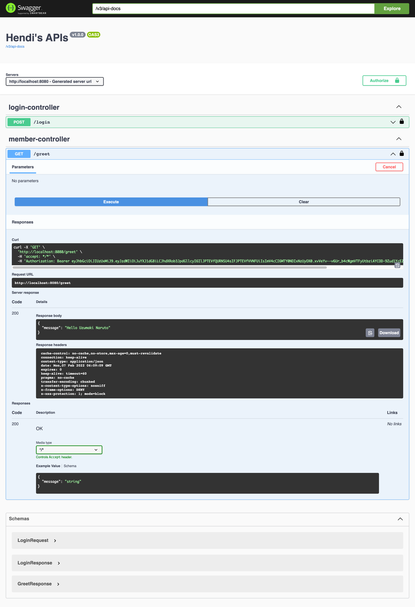

# springboot-springdoc-jwt

### Things todo list

1. Clone this repository: `git clone https://github.com/hendisantika/springboot-springdoc-jwt.git`
2. Navigate to the folder: `cd springboot-springdoc-jwt`
3. Run the application: `gradle clean bootRun`
4. Open your favorite browser: http://localhost:8080/swagger-ui/index.html

| #  | Username | Password |
|----| --- | --- |
| 1  | naruto | 123456 |
| 2  | sakura | 123456 |
| 3  | sasuke | 123456 |

### Images Screen shot

Swagger UI Page

Login Page

JWT Page

Hello Page

